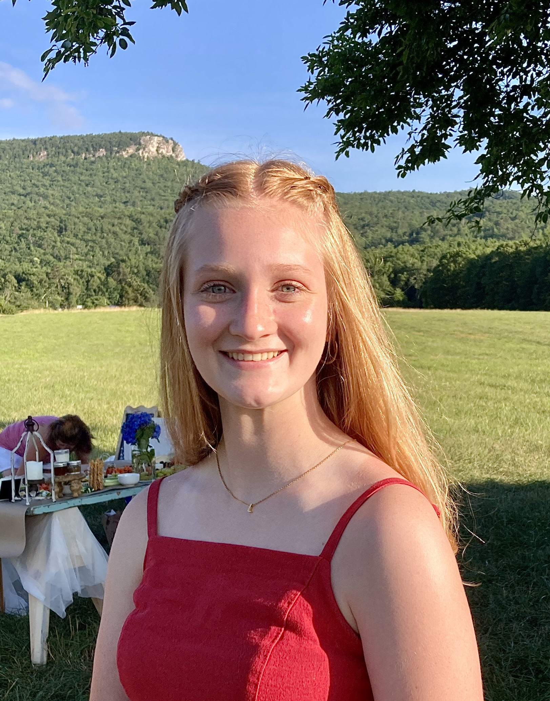

Lydia Nowak
======
 

<a href="www.linkedin.com/in/lydia-nowak-2b68b7266">LinkedIn</a>

nowaklg@appstate.edu

#### Appalachian State University, Boone, NC
#### Geography (GIS) Major and Planning Minor
##### Expected graduation date: May 2024
---
**Skills / Knowledge**
* Communication
* Efficient
* Customer Service
* Quick Learner

###### Related Courses:
* GIS Analysis & Modeling
* Environmental Remote Sensing
* Cartographic Design and Analysis
* Advanced GIS
* Biogeography

* Experience with ArcGIS, Envi, QGIS, Microsoft, and Abode Illustrator. 

**Work Experience**
###### GIS Internship for Stokes County, NC

*May 2023 - August 2023*

Worked in the GIS/Mapping Department shadowing a GIS Specialist. Created maps, udated GIS data layers, and shared data with other county departments.
